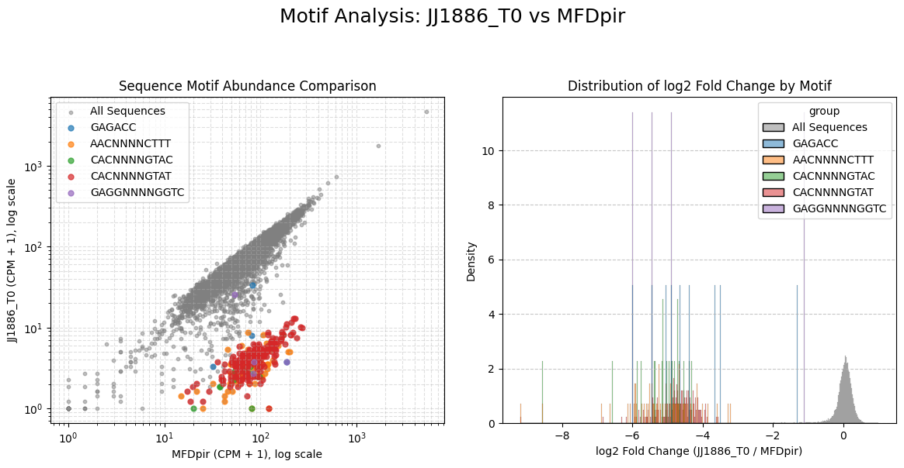

# randseq


<!-- WARNING: THIS FILE WAS AUTOGENERATED! DO NOT EDIT! -->

## Installation

Install latest from the GitHub
[repository](https://github.com/dbikard/randseq):

``` sh
$ pip install git+https://github.com/dbikard/randseq.git
```

## Usage

``` python
from randseq.core import find_restricted_motifs
from randseq.utils import calculate_log2fc
from randseq.example_data import get_example_data_dir
import pandas as pd

#Importing some example data
data_path=get_example_data_dir()
counts_file="countsTable.csv"
file_path=os.path.join(data_path,counts_file)
counts=pd.read_csv(file_path, index_col=0)
counts = counts[[col for col in counts.columns if ("_T0" in col) or ("MFDpir" in col)]]
left, right = "GTCCTAGGTATAATACTAGT", "GTTTTAGAGCTAGAAATAGC" #sequence context of the random library DNA

#Computing log2FC to reference sample
log2fc_df = calculate_log2fc(counts, reference_column='MFDpir', count_threshold=20, pseudocount=1)

#Running the pipeling
core_fixed_motifs_df, flexible_motifs_df = find_restricted_motifs(log2fc_df["JJ1886_T0"], 
                        left,
                        right, 
                        flexible_motif_patterns=[(6,0,0),(4,4,4),(3,4,4),(2,4,3),(3,5,4)],
                        )
```

    --- Starting Fixed-Position Motif Analysis (on original short sequences) ---
    Analyzing motifs of length 1 to 4, scanning positions 0 to 6 from each end, for JJ1886_T0.
    Minimum sequence support for a motif: > 5 (i.e., 6 or more)
    Found 2 core motifs at fixed positions:
      - Fixed Motif: GTG, Pos: 0, Len: 3, FracDep: 1.00, AvgFC: -4.76, N: 187
      - Fixed Motif: AAAG, Pos: 12, Len: 4, FracDep: 1.00, AvgFC: -5.08, N: 42

    --- Starting Position-Independent Motif Analysis on Filtered Sequences (with context) ---
    Filtered log2fc_series for flexible analysis: 11275 sequences remaining.
    Looking for pattern: (6, 0, 0)
    Looking for pattern: (4, 4, 4)
    Looking for pattern: (3, 4, 4)
    Looking for pattern: (2, 4, 3)
    Looking for pattern: (3, 5, 4)

    Identified 21 raw flexible motifs. Now filtering to core flexible motifs...
    Found 5 core flexible motifs:
      - Flex Motif: GAGACC (from pattern (6, 0, 0)), FracDep: 1.00, AvgFC: -4.31, N: 9
      - Flex Motif: AACNNNNCTTT (from pattern (3, 4, 4)), FracDep: 1.00, AvgFC: -5.33, N: 21
      - Flex Motif: CACNNNNGTAC (from pattern (3, 4, 4)), FracDep: 1.00, AvgFC: -5.24, N: 20
      - Flex Motif: CACNNNNGTAT (from pattern (3, 4, 4)), FracDep: 1.00, AvgFC: -4.43, N: 5
      - Flex Motif: GAGGNNNNGGTC (from pattern (4, 4, 4)), FracDep: 1.00, AvgFC: -4.36, N: 4

``` python
flexible_motifs_df
```

<div>
<style scoped>
    .dataframe tbody tr th:only-of-type {
        vertical-align: middle;
    }
&#10;    .dataframe tbody tr th {
        vertical-align: top;
    }
&#10;    .dataframe thead th {
        text-align: right;
    }
</style>

|     | motif        | fraction_depleted | num_sequences | avg_log2fc | pattern   |
|-----|--------------|-------------------|---------------|------------|-----------|
| 0   | GAGACC       | 1.0               | 9             | -4.313837  | (6, 0, 0) |
| 1   | AACNNNNCTTT  | 1.0               | 21            | -5.325198  | (3, 4, 4) |
| 2   | CACNNNNGTAC  | 1.0               | 20            | -5.237623  | (3, 4, 4) |
| 3   | CACNNNNGTAT  | 1.0               | 5             | -4.428066  | (3, 4, 4) |
| 4   | GAGGNNNNGGTC | 1.0               | 4             | -4.357958  | (4, 4, 4) |

</div>

``` python
from randseq.plotting import plot_motif_analysis
fig, axes = plot_motif_analysis(counts, "JJ1886_T0", "MFDpir", flexible_motifs_df, left, right)
```



## Documentation

Documentation can be found hosted on this GitHub
[repository](https://github.com/dbikard/randseq)’s
[pages](https://dbikard.github.io/randseq/). Additionally you can find
package manager specific guidelines on
[conda](https://anaconda.org/dbikard/randseq) and
[pypi](https://pypi.org/project/randseq/) respectively.

## Developer Guide

If you are new to using `nbdev` here are some useful pointers to get you
started.

### Install randseq in Development mode

``` sh
# make sure randseq package is installed in development mode
$ pip install -e .

# make changes under nbs/ directory
# ...

# compile to have changes apply to randseq
$ nbdev_prepare
```
