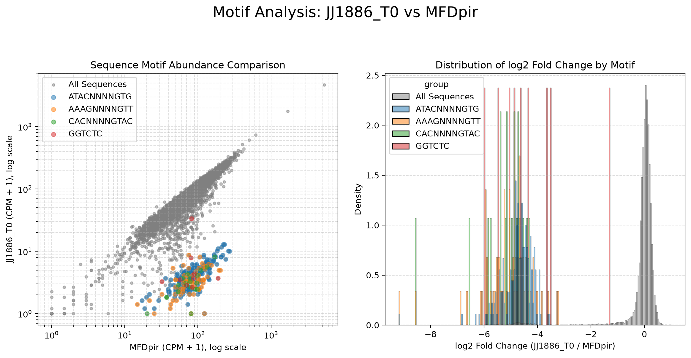

# randseq


<!-- WARNING: THIS FILE WAS AUTOGENERATED! DO NOT EDIT! -->

## Installation

Install latest from the GitHub [repository](https://github.com/dbikard/randseq):

``` sh
$ pip install git+https://github.com/dbikard/randseq.git
```

## Usage

``` python
from randseq.core import find_restricted_motifs
from randseq.utils import calculate_log2fc, get_patterns
from randseq.example_data import get_example_data_dir
import pandas as pd

#Importing some example data
data_path=get_example_data_dir()
counts_file="countsTable.csv.gz"
file_path=os.path.join(data_path,counts_file)
counts=pd.read_csv(file_path, index_col=0)
counts = counts[[col for col in counts.columns if ("_T0" in col) or ("MFDpir" in col)]]
left, right = "GTCCTAGGTATAATACTAGT", "GTTTTAGAGCTAGAAATAGC" #sequence context of the random library DNA

#Computing log2FC to reference sample
log2fc_df = calculate_log2fc(counts, reference_column='MFDpir', count_threshold=20, pseudocount=1)

#Running the pipeling
core_fixed_motifs_df, flexible_motifs_df = find_restricted_motifs(log2fc_df["JJ1886_T0"], 
                        left,
                        right, 
                        flexible_motif_patterns=[(6,0,0),(4,4,3),(4,3,4)], #alternatively you can get a comprehensive list of patterns using randseq.utils.get_patterns()
                        )
```

    --- Starting Fixed-Position Motif Analysis (on original short sequences) ---
    Analyzing motifs of length 1 to 4, scanning positions 0 to 6 from each end, for JJ1886_T0.
    Minimum sequence support for a motif: > 5 (i.e., 6 or more)
    Found 2 core motifs at fixed positions:
      - Fixed Motif: GTG, Pos: 0, Len: 3, FracDep: 1.00, AvgFC: -4.76, N: 187
      - Fixed Motif: AAAG, Pos: 12, Len: 4, FracDep: 1.00, AvgFC: -5.08, N: 42

    --- Starting Position-Independent Motif Analysis on Filtered Sequences (with context) ---
    Filtered log2fc_series for flexible analysis: 11275 sequences remaining.
    20 candidate(s) across all patterns; 8 remain after redundancy filtering.
    4 candidate(s) explained by a stronger motif:
        AAGTNNNGTTA <- AAAGNNNNGTT (without it: n=1, score=0.00)
        ACACNNNCGTA <- GTACNNNNGTG (without it: n=1, score=0.00)
        GCACNNNNGTA <- ATACNNNNGTG (without it: n=3, score=0.67)
        TACGNNNGTGA <- GTACNNNNGTG (without it: n=3, score=0.33)

    4 candidate motifs remain. Now filtering to core flexible motifs...

    Now filtering to remove sequences with multiple motifs from the analysis and dropping motifs that no longer pass the thresholds
    (Scoring 4 candidate motifs — this step is O(N²), may take a moment...)

    4 motifs remaining:
    GAGACC (from pattern (6, 0, 0)), FracDep: 1.00, AvgFC: -4.31, N: 9
    GTACNNNNGTG (from pattern (4, 4, 3)), FracDep: 1.00, AvgFC: -5.06, N: 19
    ATACNNNNGTG (from pattern (4, 4, 3)), FracDep: 1.00, AvgFC: -4.73, N: 191
    AAAGNNNNGTT (from pattern (4, 4, 3)), FracDep: 1.00, AvgFC: -5.04, N: 61

    Scanning patterns:   0%|          | 0/3 [00:00<?, ?it/s]
    Scanning patterns: 100%|##########| 3/3 [00:00<00:00, 40.42it/s]

``` python
flexible_motifs_df
```

<div>
<style scoped>
    .dataframe tbody tr th:only-of-type {
        vertical-align: middle;
    }
&#10;    .dataframe tbody tr th {
        vertical-align: top;
    }
&#10;    .dataframe thead th {
        text-align: right;
    }
</style>

|  | motif | fraction_depleted | num_sequences | avg_log2fc | p_value | pattern | q_value | called | bimodality | bimodal |
|----|----|----|----|----|----|----|----|----|----|----|
| 3 | ATACNNNNGTG | 1.0 | 191 | -4.732529 | 7.031701e-264 | (4, 4, 3) | 3.858998e-259 | True | 0.405340 | False |
| 5 | AAAGNNNNGTT | 1.0 | 61 | -5.037651 | 9.044635e-85 | (4, 4, 3) | 2.481848e-80 | True | 0.402660 | False |
| 2 | CACNNNNGTAC | 1.0 | 19 | -5.062006 | 6.644808e-27 | (4, 4, 3) | 7.293341e-23 | True | 0.653875 | True |
| 0 | GGTCTC | 1.0 | 9 | -4.313837 | 3.982202e-13 | (6, 0, 0) | 2.185432e-09 | True | 0.391853 | False |

</div>

``` python
from randseq.plotting import plot_motif_analysis
fig, axes = plot_motif_analysis(counts, "JJ1886_T0", "MFDpir", flexible_motifs_df, left, right)
```



## Documentation

Documentation can be found hosted on this GitHub [repository](https://github.com/dbikard/randseq)’s [pages](https://dbikard.github.io/randseq/). Additionally you can find package manager specific guidelines on [conda](https://anaconda.org/dbikard/randseq) and [pypi](https://pypi.org/project/randseq/) respectively.

## Developer Guide

If you are new to using `nbdev` here are some useful pointers to get you started.

### Install randseq in Development mode

``` sh
# make sure randseq package is installed in development mode
$ pip install -e .

# make changes under nbs/ directory
# ...

# compile to have changes apply to randseq
$ nbdev-prepare
```
