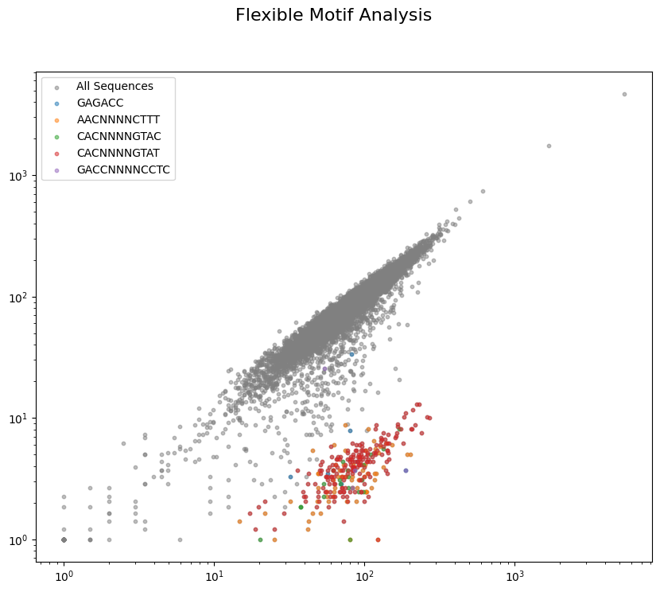

# core


<!-- WARNING: THIS FILE WAS AUTOGENERATED! DO NOT EDIT! -->

### 1. Computing the log2fc of the sequences from counts data

``` python
counts_file="countsTable.csv"
file_path=os.path.join(data_path,counts_file)
counts=pd.read_csv(file_path, index_col=0)
counts = counts[[col for col in counts.columns if ("_T0" in col) or ("MFDpir" in col)]]

log2fc_df = calculate_log2fc(counts, reference_column='MFDpir', count_threshold=20, pseudocount=1)
log2fc_df
```

<div>
<style scoped>
    .dataframe tbody tr th:only-of-type {
        vertical-align: middle;
    }
&#10;    .dataframe tbody tr th {
        vertical-align: top;
    }
&#10;    .dataframe thead th {
        text-align: right;
    }
</style>

<table class="dataframe" data-quarto-postprocess="true" data-border="1">
<thead>
<tr style="text-align: right;">
<th data-quarto-table-cell-role="th"></th>
<th data-quarto-table-cell-role="th">K12_T0</th>
<th data-quarto-table-cell-role="th">HS_T0</th>
<th data-quarto-table-cell-role="th">E1114_T0</th>
<th data-quarto-table-cell-role="th">E1167_T0</th>
<th data-quarto-table-cell-role="th">H120_T0</th>
<th data-quarto-table-cell-role="th">TA054_T0</th>
<th data-quarto-table-cell-role="th">TA447_T0</th>
<th data-quarto-table-cell-role="th">E101_T0</th>
<th data-quarto-table-cell-role="th">41-1Ti9_T0</th>
<th data-quarto-table-cell-role="th">TA280_T0</th>
<th data-quarto-table-cell-role="th">M114_T0</th>
<th data-quarto-table-cell-role="th">TA249_T0</th>
<th data-quarto-table-cell-role="th">ROAR8_T0</th>
<th data-quarto-table-cell-role="th">JJ1886_T0</th>
<th data-quarto-table-cell-role="th">CFT073_T0</th>
<th data-quarto-table-cell-role="th">APECO1_T0</th>
<th data-quarto-table-cell-role="th">UTI89_T0</th>
<th data-quarto-table-cell-role="th">S88_T0</th>
<th data-quarto-table-cell-role="th">MG1655_T0</th>
</tr>
</thead>
<tbody>
<tr>
<td data-quarto-table-cell-role="th">CGGAGGTACTGGGTACATTT</td>
<td>0.043818</td>
<td>0.049551</td>
<td>0.187868</td>
<td>-0.302314</td>
<td>0.238304</td>
<td>0.051836</td>
<td>0.186450</td>
<td>0.093344</td>
<td>0.029484</td>
<td>0.106924</td>
<td>-0.329062</td>
<td>-0.102645</td>
<td>0.144280</td>
<td>0.084854</td>
<td>0.212674</td>
<td>0.229591</td>
<td>-0.457070</td>
<td>0.213624</td>
<td>0.090458</td>
</tr>
<tr>
<td data-quarto-table-cell-role="th">TGGCGATAATGCCGGCTATC</td>
<td>0.045463</td>
<td>0.137127</td>
<td>0.437387</td>
<td>0.113014</td>
<td>0.137767</td>
<td>0.060845</td>
<td>0.063668</td>
<td>-0.014449</td>
<td>-0.008977</td>
<td>-0.025606</td>
<td>0.003605</td>
<td>0.084441</td>
<td>-0.167417</td>
<td>0.018354</td>
<td>0.041919</td>
<td>0.016410</td>
<td>-0.207488</td>
<td>0.092292</td>
<td>0.101627</td>
</tr>
<tr>
<td data-quarto-table-cell-role="th">TTCCAGTTCACTGGTCTTCG</td>
<td>-0.049694</td>
<td>0.049903</td>
<td>-0.105148</td>
<td>-0.061620</td>
<td>-0.081886</td>
<td>-0.072083</td>
<td>0.402207</td>
<td>0.087885</td>
<td>0.207649</td>
<td>0.127306</td>
<td>0.204781</td>
<td>-0.106153</td>
<td>-0.012804</td>
<td>0.285761</td>
<td>-0.167107</td>
<td>0.269887</td>
<td>0.182096</td>
<td>0.458076</td>
<td>0.128330</td>
</tr>
<tr>
<td data-quarto-table-cell-role="th">AATTTCAGTGCCGTTCAGAT</td>
<td>-0.251957</td>
<td>-0.422224</td>
<td>-0.224591</td>
<td>-0.058728</td>
<td>-0.204575</td>
<td>-0.192908</td>
<td>-0.220676</td>
<td>-0.143054</td>
<td>-0.277042</td>
<td>-0.205084</td>
<td>0.058866</td>
<td>-0.064442</td>
<td>-0.029019</td>
<td>-0.042375</td>
<td>-0.095307</td>
<td>-0.254714</td>
<td>0.460256</td>
<td>-0.183890</td>
<td>-0.180938</td>
</tr>
<tr>
<td data-quarto-table-cell-role="th">CTGCGGTAATAATTCCCGCC</td>
<td>-0.178427</td>
<td>-0.154025</td>
<td>0.581087</td>
<td>0.401967</td>
<td>0.047002</td>
<td>-0.309751</td>
<td>-0.200689</td>
<td>-0.292042</td>
<td>-0.473919</td>
<td>-0.298991</td>
<td>-0.221896</td>
<td>-0.060500</td>
<td>0.085888</td>
<td>-0.279165</td>
<td>-0.206676</td>
<td>-0.097563</td>
<td>-0.347949</td>
<td>-0.188758</td>
<td>-0.186226</td>
</tr>
<tr>
<td data-quarto-table-cell-role="th">...</td>
<td>...</td>
<td>...</td>
<td>...</td>
<td>...</td>
<td>...</td>
<td>...</td>
<td>...</td>
<td>...</td>
<td>...</td>
<td>...</td>
<td>...</td>
<td>...</td>
<td>...</td>
<td>...</td>
<td>...</td>
<td>...</td>
<td>...</td>
<td>...</td>
<td>...</td>
</tr>
<tr>
<td data-quarto-table-cell-role="th">GCTTGATGTAGCCTTCGAAC</td>
<td>-0.100518</td>
<td>-0.079966</td>
<td>0.027302</td>
<td>-0.268222</td>
<td>-0.337706</td>
<td>-0.047079</td>
<td>-0.072379</td>
<td>-0.246364</td>
<td>-0.250380</td>
<td>-0.142468</td>
<td>-0.091826</td>
<td>-0.004635</td>
<td>0.260965</td>
<td>-0.174715</td>
<td>0.278843</td>
<td>-0.206298</td>
<td>-0.319604</td>
<td>-0.055837</td>
<td>-0.133185</td>
</tr>
<tr>
<td data-quarto-table-cell-role="th">TAATGGCAAATTGACACTCC</td>
<td>0.258205</td>
<td>0.103683</td>
<td>0.428049</td>
<td>-0.106268</td>
<td>0.247864</td>
<td>0.050536</td>
<td>0.240706</td>
<td>0.133009</td>
<td>0.195027</td>
<td>0.096144</td>
<td>0.482377</td>
<td>-0.168566</td>
<td>-0.008969</td>
<td>0.224936</td>
<td>0.009979</td>
<td>0.217354</td>
<td>0.453491</td>
<td>0.201961</td>
<td>0.387054</td>
</tr>
<tr>
<td data-quarto-table-cell-role="th">GCTGCGCGCGGAGTTGTTCC</td>
<td>-0.629856</td>
<td>-0.381054</td>
<td>-0.431536</td>
<td>-0.328063</td>
<td>-0.461695</td>
<td>-0.258496</td>
<td>-0.442414</td>
<td>-0.358037</td>
<td>-0.372732</td>
<td>-0.359784</td>
<td>-0.581490</td>
<td>0.174623</td>
<td>-0.984388</td>
<td>-0.273490</td>
<td>-0.490203</td>
<td>-0.122278</td>
<td>-0.562652</td>
<td>-0.497605</td>
<td>-0.959646</td>
</tr>
<tr>
<td data-quarto-table-cell-role="th">GCAACACGCCAGTAAGGTGT</td>
<td>0.693416</td>
<td>0.487153</td>
<td>0.744586</td>
<td>-0.054785</td>
<td>0.474863</td>
<td>0.585146</td>
<td>0.162493</td>
<td>0.388078</td>
<td>0.733043</td>
<td>0.280496</td>
<td>0.167936</td>
<td>0.605561</td>
<td>0.400524</td>
<td>0.051808</td>
<td>0.422091</td>
<td>0.098976</td>
<td>0.294288</td>
<td>0.064457</td>
<td>0.376418</td>
</tr>
<tr>
<td data-quarto-table-cell-role="th">GATAGCCGGATAGCTTAAGG</td>
<td>-0.245685</td>
<td>-0.131631</td>
<td>-0.429244</td>
<td>-0.213968</td>
<td>-0.271218</td>
<td>-0.171113</td>
<td>-0.015624</td>
<td>-0.355447</td>
<td>-0.236553</td>
<td>-0.093049</td>
<td>-0.299090</td>
<td>-0.282985</td>
<td>-0.134136</td>
<td>-0.079377</td>
<td>-0.211507</td>
<td>-0.151722</td>
<td>-0.154721</td>
<td>-0.400835</td>
<td>0.140210</td>
</tr>
</tbody>
</table>

<p>11503 rows × 19 columns</p>
</div>

### 2. Obtaining the sequence context of the variable sequence to identify sites at the boundaries of the variable sequence

------------------------------------------------------------------------

<a
href="https://github.com/dbikard/randseq/blob/main/randseq/core.py#L29"
target="_blank" style="float:right; font-size:smaller">source</a>

### get_lib_seq_context

>  get_lib_seq_context (seqs, left, right)

\*Generates a list of sequences by combining a left and right sequence
with each sequence in the input list.

Args: seqs (list): List of sequences to be combined. left (str): Left
sequence to prepend. right (str): Right sequence to append.

Returns: list: List of combined sequences.\*

``` python
left, right = "GTCCTAGGTATAATACTAGT", "GTTTTAGAGCTAGAAATAGC"
lib=get_lib_seq_context(log2fc_df.index,left,right)
lib[:5]
```

    ['GTCCTAGGTATAATACTAGTCGGAGGTACTGGGTACATTTGTTTTAGAGCTAGAAATAGC',
     'GTCCTAGGTATAATACTAGTTGGCGATAATGCCGGCTATCGTTTTAGAGCTAGAAATAGC',
     'GTCCTAGGTATAATACTAGTTTCCAGTTCACTGGTCTTCGGTTTTAGAGCTAGAAATAGC',
     'GTCCTAGGTATAATACTAGTAATTTCAGTGCCGTTCAGATGTTTTAGAGCTAGAAATAGC',
     'GTCCTAGGTATAATACTAGTCTGCGGTAATAATTCCCGCCGTTTTAGAGCTAGAAATAGC']

### 3. Listing all the sequence motifs found in our library that follow a specific pattern

The pattern is a list of 3 numbers: 1. The number of defined bases in
the first part of the site  
2. The number of undefined bases in the middle  
3. The number of defined bases in the second part of the site

------------------------------------------------------------------------

<a
href="https://github.com/dbikard/randseq/blob/main/randseq/core.py#L48"
target="_blank" style="float:right; font-size:smaller">source</a>

### get_sites_in_seq

>  get_sites_in_seq (lib, pattern=(3, 6, 4), no_ori=True)

*Computes the list of unique sites matching the pattern present in each
sequence of the library The pattern is a list of 3 number: 1. The number
of defined bases in the first part of the site 2. The number of
undefined bases in the middle 3. The number of defined bases in the
second part of the site*

``` python
lib=get_lib_seq_context(log2fc_df.index,left,right)
sites_in_seq=get_sites_in_seq(lib,pattern=(3,6,4),no_ori=True)
assert len(sites_in_seq) == len(lib)
print(f"First 5 pattern matching sequences found in the first sequence of the library:")
list(sites_in_seq[0])[:5]
```

    First 5 pattern matching sequences found in the first sequence of the library:

    ['AGCNNNNNNTAGC',
     'CTGNNNNNNTTTG',
     'TAGNNNNNNAAAT',
     'ACTNNNNNNATTT',
     'ACANNNNNNCCCA']

------------------------------------------------------------------------

<a
href="https://github.com/dbikard/randseq/blob/main/randseq/core.py#L76"
target="_blank" style="float:right; font-size:smaller">source</a>

### score

>  score (FCs, thr=-1)

*Returns the fraction of sequences depleted below the thr value. Handles
empty lists of FCs by returning 0.*

``` python
assert score([-2,-0.5,-0.1,-5],thr=-1) == 0.5
```

------------------------------------------------------------------------

<a
href="https://github.com/dbikard/randseq/blob/main/randseq/core.py#L86"
target="_blank" style="float:right; font-size:smaller">source</a>

### identify_depleted_motifs_scanning_ends

>  identify_depleted_motifs_scanning_ends (log2fc_series, scan_depth_k=6,
>                                              max_motif_length=6,
>                                              depletion_threshold=-1,
>                                              score_thr=0.85,
>                                              min_sequence_support=5)

\*Identifies DNA motifs associated with sequence depletion by scanning k
positions from both the left and right ends of sequences, using a pandas
Series of log2FC values.

Args: log2fc_series (pd.Series): pandas Series with sequences (DNA
strings) as index and log2FC values as data. scan_depth_k (int): The
number of positions to scan from each end (0 to k inclusive).
max_motif_length (int): The maximum length of the motif to consider.
depletion_threshold (float): The log2FC threshold for considering a
sequence depleted. min_sequence_support (int): The minimum number of
sequences (strictly greater than this value) a motif must be found in to
be included in the results.

Returns: pd.DataFrame: A DataFrame with identified motifs, their length,
actual 0-indexed position, number of occurrences, average log2FC, and
depletion score (fraction_depleted). Sorted by primary depletion
metrics.\*

``` python
depleted_motifs_df=identify_depleted_motifs_scanning_ends(log2fc_df["JJ1886_T0"])
depleted_motifs_df.head(10)
```

    Analyzing motifs of length 1 to 6, scanning positions 0 to 6 from each end, for JJ1886_T0.
    Minimum sequence support for a motif: > 5 (i.e., 6 or more)

<div>
<style scoped>
    .dataframe tbody tr th:only-of-type {
        vertical-align: middle;
    }
&#10;    .dataframe tbody tr th {
        vertical-align: top;
    }
&#10;    .dataframe thead th {
        text-align: right;
    }
</style>

<table class="dataframe" data-quarto-postprocess="true" data-border="1">
<thead>
<tr style="text-align: right;">
<th data-quarto-table-cell-role="th"></th>
<th data-quarto-table-cell-role="th">motif</th>
<th data-quarto-table-cell-role="th">length</th>
<th data-quarto-table-cell-role="th">position</th>
<th data-quarto-table-cell-role="th">num_sequences</th>
<th data-quarto-table-cell-role="th">avg_log2fc</th>
<th data-quarto-table-cell-role="th">fraction_depleted</th>
</tr>
</thead>
<tbody>
<tr>
<td data-quarto-table-cell-role="th">8695</td>
<td>AAAAG</td>
<td>5</td>
<td>11</td>
<td>10</td>
<td>-5.662158</td>
<td>1.0</td>
</tr>
<tr>
<td data-quarto-table-cell-role="th">22013</td>
<td>GTGCGG</td>
<td>6</td>
<td>0</td>
<td>6</td>
<td>-5.490821</td>
<td>1.0</td>
</tr>
<tr>
<td data-quarto-table-cell-role="th">12567</td>
<td>AAAGT</td>
<td>5</td>
<td>12</td>
<td>13</td>
<td>-5.262390</td>
<td>1.0</td>
</tr>
<tr>
<td data-quarto-table-cell-role="th">12568</td>
<td>CAAAG</td>
<td>5</td>
<td>11</td>
<td>16</td>
<td>-5.201596</td>
<td>1.0</td>
</tr>
<tr>
<td data-quarto-table-cell-role="th">17472</td>
<td>GTGCG</td>
<td>5</td>
<td>0</td>
<td>10</td>
<td>-5.107176</td>
<td>1.0</td>
</tr>
<tr>
<td data-quarto-table-cell-role="th">2571</td>
<td>AAAG</td>
<td>4</td>
<td>12</td>
<td>42</td>
<td>-5.076919</td>
<td>1.0</td>
</tr>
<tr>
<td data-quarto-table-cell-role="th">2580</td>
<td>AAAGC</td>
<td>5</td>
<td>12</td>
<td>9</td>
<td>-5.029139</td>
<td>1.0</td>
</tr>
<tr>
<td data-quarto-table-cell-role="th">17128</td>
<td>AAAGA</td>
<td>5</td>
<td>12</td>
<td>13</td>
<td>-4.996286</td>
<td>1.0</td>
</tr>
<tr>
<td data-quarto-table-cell-role="th">10197</td>
<td>GTGTC</td>
<td>5</td>
<td>0</td>
<td>6</td>
<td>-4.959089</td>
<td>1.0</td>
</tr>
<tr>
<td data-quarto-table-cell-role="th">23364</td>
<td>AAAGG</td>
<td>5</td>
<td>12</td>
<td>7</td>
<td>-4.943650</td>
<td>1.0</td>
</tr>
</tbody>
</table>

</div>

------------------------------------------------------------------------

<a
href="https://github.com/dbikard/randseq/blob/main/randseq/core.py#L191"
target="_blank" style="float:right; font-size:smaller">source</a>

### filter_to_core_motifs

>  filter_to_core_motifs (depleted_motifs_df, score_improvement_margin=0.05)

\*Filters a DataFrame of depleted motifs to identify underlying “core”
motifs. A longer motif is kept only if it’s significantly better than a
shorter core motif it contains.

Args: depleted_motifs_df (pd.DataFrame): DataFrame from
identify_depleted_motifs_scanning_ends. score_improvement_margin
(float): A longer motif’s ‘fraction_depleted’ must be greater than the
core motif’s score by this margin. fc_improvement_margin (float): A
longer motif’s ‘avg_log2fc’ must be lower than the core motif’s
avg_log2fc by this margin.

Returns: pd.DataFrame: A filtered DataFrame containing potentially core
motifs.\*

``` python
depleted_motifs_df=filter_to_core_motifs(depleted_motifs_df)
depleted_motifs_df.head(10)
```

<div>
<style scoped>
    .dataframe tbody tr th:only-of-type {
        vertical-align: middle;
    }
&#10;    .dataframe tbody tr th {
        vertical-align: top;
    }
&#10;    .dataframe thead th {
        text-align: right;
    }
</style>

<table class="dataframe" data-quarto-postprocess="true" data-border="1">
<thead>
<tr style="text-align: right;">
<th data-quarto-table-cell-role="th"></th>
<th data-quarto-table-cell-role="th">motif</th>
<th data-quarto-table-cell-role="th">length</th>
<th data-quarto-table-cell-role="th">position</th>
<th data-quarto-table-cell-role="th">num_sequences</th>
<th data-quarto-table-cell-role="th">avg_log2fc</th>
<th data-quarto-table-cell-role="th">fraction_depleted</th>
</tr>
</thead>
<tbody>
<tr>
<td data-quarto-table-cell-role="th">0</td>
<td>GTG</td>
<td>3</td>
<td>0</td>
<td>187</td>
<td>-4.764500</td>
<td>1.0</td>
</tr>
<tr>
<td data-quarto-table-cell-role="th">1</td>
<td>AAAG</td>
<td>4</td>
<td>12</td>
<td>42</td>
<td>-5.076919</td>
<td>1.0</td>
</tr>
</tbody>
</table>

</div>

------------------------------------------------------------------------

<a
href="https://github.com/dbikard/randseq/blob/main/randseq/core.py#L249"
target="_blank" style="float:right; font-size:smaller">source</a>

### get_fold_change_values_per_site

>  get_fold_change_values_per_site (site_sets_list, fold_changes_list)

\*Computes a dictionary mapping each unique site to a list of its
associated log2 Fold Change (FC) values.

Args: site_sets_list (list): A list of sets, where each set contains the
sequence motifs found in a member of the library. fold_changes_list
(list): A list of log2FC values, corresponding to each sequence in the
library.

Returns: dict: A dictionary where keys are sequence motifs and values
are numpy arrays containing the log2FC values associated with that
site.\*

``` python
pattern=(3,6,4)
set_list=get_sites_in_seq(lib,pattern=pattern,no_ori=True)
site_FCs=get_fold_change_values_per_site(set_list,log2fc_df["JJ1886_T0"].values)
site_FCs["AGCNNNNNNGGGA"]
```

    array([ 0.02025893, -0.15083807,  0.19052559,  0.04266223,  0.22493562,
           -0.13188093,  0.0203179 ,  0.10373391, -0.18265707,  0.24137364,
           -0.10160173,  0.5539999 ,  0.19568499,  0.29179059, -0.02109236,
           -0.46896125,  0.00812423])

------------------------------------------------------------------------

<a
href="https://github.com/dbikard/randseq/blob/main/randseq/core.py#L288"
target="_blank" style="float:right; font-size:smaller">source</a>

### filter_sequences_without_core_motifs

>  filter_sequences_without_core_motifs (log2fc_series, core_motifs_df)

\*Filters an original log2fc Series to remove sequences that contain any
of the specified core motifs.

Args: log2fc_series (pd.Series): Series with sequences as its index and
log2FC values. core_motifs_df (pd.DataFrame): DataFrame of core motifs,
must include ‘motif’, ‘position’, and ‘length’ columns.

Returns: pd.Series: A new Series containing only sequences (and their
log2FC values) from log2fc_series that do not carry any of the core
motifs.\*

``` python
filted_log2fc_df = filter_sequences_without_core_motifs(log2fc_df, depleted_motifs_df)
```

------------------------------------------------------------------------

<a
href="https://github.com/dbikard/randseq/blob/main/randseq/core.py#L343"
target="_blank" style="float:right; font-size:smaller">source</a>

### get_sites_scores

>  get_sites_scores (site_FCs, pattern, log2FC_thr=-1)

*Scores sites based on depletion and occurrence. Returns a pandas
DataFrame with ‘site’, ‘fraction_depleted’, ‘num_sequences’,
‘avg_log2fc’.*

``` python
site_scores = get_sites_scores(site_FCs,pattern)
site_scores.sort_values(by=['fraction_depleted', 'num_sequences'], ascending=[False, False]).head(10)
```

<div>
<style scoped>
    .dataframe tbody tr th:only-of-type {
        vertical-align: middle;
    }
&#10;    .dataframe tbody tr th {
        vertical-align: top;
    }
&#10;    .dataframe thead th {
        text-align: right;
    }
</style>

<table class="dataframe" data-quarto-postprocess="true" data-border="1">
<thead>
<tr style="text-align: right;">
<th data-quarto-table-cell-role="th"></th>
<th data-quarto-table-cell-role="th">motif</th>
<th data-quarto-table-cell-role="th">fraction_depleted</th>
<th data-quarto-table-cell-role="th">num_sequences</th>
<th data-quarto-table-cell-role="th">avg_log2fc</th>
</tr>
</thead>
<tbody>
<tr>
<td data-quarto-table-cell-role="th">2652</td>
<td>AGGNNNNNNCCTC</td>
<td>1.000000</td>
<td>1</td>
<td>-4.601867</td>
</tr>
<tr>
<td data-quarto-table-cell-role="th">8786</td>
<td>GAGNNNNNNCCCC</td>
<td>1.000000</td>
<td>1</td>
<td>-1.406262</td>
</tr>
<tr>
<td data-quarto-table-cell-role="th">4410</td>
<td>CACNNNNNNATTA</td>
<td>0.958974</td>
<td>195</td>
<td>-4.569183</td>
</tr>
<tr>
<td data-quarto-table-cell-role="th">952</td>
<td>AATNNNNNNGTGC</td>
<td>0.826923</td>
<td>52</td>
<td>-3.962960</td>
</tr>
<tr>
<td data-quarto-table-cell-role="th">953</td>
<td>AATNNNNNNGTGG</td>
<td>0.815385</td>
<td>65</td>
<td>-3.883041</td>
</tr>
<tr>
<td data-quarto-table-cell-role="th">12519</td>
<td>TAANNNNNNTGTG</td>
<td>0.785714</td>
<td>238</td>
<td>-3.746732</td>
</tr>
<tr>
<td data-quarto-table-cell-role="th">951</td>
<td>AATNNNNNNGTGA</td>
<td>0.771429</td>
<td>70</td>
<td>-3.628320</td>
</tr>
<tr>
<td data-quarto-table-cell-role="th">8882</td>
<td>GAGNNNNNNGTCT</td>
<td>0.750000</td>
<td>4</td>
<td>-4.012801</td>
</tr>
<tr>
<td data-quarto-table-cell-role="th">954</td>
<td>AATNNNNNNGTGT</td>
<td>0.740741</td>
<td>54</td>
<td>-3.485249</td>
</tr>
<tr>
<td data-quarto-table-cell-role="th">11042</td>
<td>GGTNNNNNNAGGA</td>
<td>0.666667</td>
<td>3</td>
<td>-2.235343</td>
</tr>
</tbody>
</table>

</div>

------------------------------------------------------------------------

<a
href="https://github.com/dbikard/randseq/blob/main/randseq/core.py#L370"
target="_blank" style="float:right; font-size:smaller">source</a>

### filter_to_core_flexible_motifs

>  filter_to_core_flexible_motifs (flexible_motifs_df, score_margin=0.05)

\*Filters a DataFrame of flexible (position-independent) motifs to
identify underlying “core” motifs. A longer/more complex motif is
removed if its score is not significantly better than a simpler core
motif pattern it contains.

Args: flexible_motifs_df (pd.DataFrame): DataFrame with ‘site’,
‘pattern’ (string like ‘(3,4,4)’), ‘fraction_depleted’, ‘num_sequences’,
‘avg_log2fc’. score_margin (float): A more complex motif is subsumed if
its ‘fraction_depleted’ is not better than (core_score - score_margin).
Effectively, if candidate_score \>= core_score - score_margin, it’s
subsumed.

Returns: pd.DataFrame: A filtered DataFrame containing potentially core
flexible motifs.\*

``` python
def analyze_motif_pipeline(log2fc_series, 
                           left_context_str, 
                           right_context_str, 
                           fixed_motif_scan_depth_k=0,
                           fixed_motif_max_length=6,
                           fixed_motif_depletion_thr=-1,
                           fixed_motif_score_thr=0.8,
                           fixed_motif_min_support=5,
                           core_motif_score_margin=0.05, # For fixed motifs
                           flexible_motif_patterns=[(6,0,0),(3,4,4)], 
                           flexible_motif_log2fc_thr=-1,
                           flexible_motif_min_support=5,
                           flexible_motif_score_thr=0.8,
                           core_flexible_motif_score_margin=0.05 # For flexible motifs
                           ):
    """
    Full pipeline to identify fixed-position core motifs and then position-independent motifs
    (from a list of patterns) in the remaining sequences (with context for flexible search).
    """
    print("--- Starting Fixed-Position Motif Analysis (on original short sequences) ---")
    depleted_fixed_motifs_df = identify_depleted_motifs_scanning_ends(
        log2fc_series, 
        scan_depth_k=fixed_motif_scan_depth_k,
        max_motif_length=fixed_motif_max_length,
        depletion_threshold=fixed_motif_depletion_thr,
        score_thr=fixed_motif_score_thr,
        min_sequence_support=fixed_motif_min_support
    )
    core_fixed_motifs_df = filter_to_core_motifs( 
        depleted_fixed_motifs_df,
        score_improvement_margin=core_motif_score_margin
    )
    if core_fixed_motifs_df.empty:
        print("No core motifs found at fixed positions.")
    else:
        print(f"Found {len(core_fixed_motifs_df)} core motifs at fixed positions:")
        for _, row in core_fixed_motifs_df.iterrows():
            print(f"  - Fixed Motif: {row['motif']}, Pos: {row['position']}, Len: {row['length']}, FracDep: {row['fraction_depleted']:.2f}, AvgFC: {row['avg_log2fc']:.2f}, N: {row['num_sequences']}")

    print("\n--- Starting Position-Independent Motif Analysis on Filtered Sequences (with context) ---")
    log2fc_series_for_flexible_analysis = filter_sequences_without_core_motifs(
        log2fc_series, 
        core_fixed_motifs_df 
    )
    if len(log2fc_series_for_flexible_analysis) == len(log2fc_series):
        print("No sequences were filtered out based on fixed-position core motifs (or no core motifs found).")
    else:
        print(f"Filtered log2fc_series for flexible analysis: {len(log2fc_series_for_flexible_analysis)} sequences remaining.")

    if log2fc_series_for_flexible_analysis.empty:
        print("No sequences remaining for flexible motif analysis after filtering.")
        flexible_motifs_results_df = pd.DataFrame(columns=['motif', 'pattern', 'fraction_depleted', 'num_sequences', 'avg_log2fc']) 
        return core_fixed_motifs_df, flexible_motifs_results_df

    short_sequences_for_flex_analysis = log2fc_series_for_flexible_analysis.index.tolist()
    sequences_with_context_for_flex = get_lib_seq_context(
        short_sequences_for_flex_analysis, 
        left_context_str, 
        right_context_str
    )
    fc_values_for_flexible_analysis = log2fc_series_for_flexible_analysis.tolist()
    
    all_flexible_motifs_data_list = [] 

    if not isinstance(flexible_motif_patterns, list):
        print("Warning: flexible_motif_patterns should be a list. Wrapping it in a list.")
        flexible_motif_patterns = [flexible_motif_patterns]
    
    for current_flex_pattern in flexible_motif_patterns:
        # print(f"  Pattern: {current_flex_pattern}") # Reduced verbosity
        site_sets_flexible = get_sites_in_seq(
            sequences_with_context_for_flex, 
            pattern=current_flex_pattern, 
            no_ori=True 
        )
        if len(site_sets_flexible) != len(fc_values_for_flexible_analysis):
            print(f"    Error: Mismatch in length between site sets ({len(site_sets_flexible)}) and FC values ({len(fc_values_for_flexible_analysis)}) for pattern {current_flex_pattern}. Skipping this pattern.")
            continue

        site_fcs_flexible = get_fold_change_values_per_site(
            site_sets_flexible,
            fc_values_for_flexible_analysis 
        )
        current_pattern_scores_df = get_sites_scores( 
            site_fcs_flexible,
            pattern=current_flex_pattern, 
            log2FC_thr=flexible_motif_log2fc_thr
        )
        
        if not current_pattern_scores_df.empty:
            current_pattern_scores_df.rename(columns={'site': 'motif'}, inplace=True) 
            current_pattern_scores_df['pattern'] = str(current_flex_pattern) 
            filtered_for_this_pattern = current_pattern_scores_df[
                (current_pattern_scores_df['fraction_depleted'] > flexible_motif_score_thr) &
                (current_pattern_scores_df['num_sequences'] > flexible_motif_min_support)
            ]
            if not filtered_for_this_pattern.empty:
                all_flexible_motifs_data_list.append(filtered_for_this_pattern)

    if not all_flexible_motifs_data_list:
        print(f"\nNo flexible motifs found meeting initial support > {flexible_motif_min_support} and score > {flexible_motif_score_thr} for any provided pattern.")
        flexible_motifs_results_df = pd.DataFrame(columns=['motif', 'pattern', 'fraction_depleted', 'num_sequences', 'avg_log2fc']) 
    else:
        combined_flexible_motifs_df = pd.concat(all_flexible_motifs_data_list, ignore_index=True)
        print(f"\nIdentified {len(combined_flexible_motifs_df)} raw flexible motifs. Now filtering to core flexible motifs...")
        
        flexible_motifs_results_df = filter_to_core_flexible_motifs( 
            combined_flexible_motifs_df,
            score_margin=core_flexible_motif_score_margin 
        )
        if flexible_motifs_results_df.empty:
            print("No core flexible motifs remained after filtering.")
        else:
            print(f"Found {len(flexible_motifs_results_df)} core flexible motifs:")
            for _, row in flexible_motifs_results_df.iterrows():
                 print(f"  - Flex Motif: {row['motif']} (from pattern {row['pattern']}), FracDep: {row['fraction_depleted']:.2f}, AvgFC: {row['avg_log2fc']:.2f}, N: {row['num_sequences']}")
        
    return core_fixed_motifs_df, flexible_motifs_results_df
```

``` python
core_fixed_motifs_df, flexible_motifs_df = analyze_motif_pipeline(log2fc_df["JJ1886_T0"], 
                        left,
                        right, 
                        fixed_motif_scan_depth_k=6,
                        fixed_motif_max_length=5,
                        fixed_motif_depletion_thr=-1,
                        fixed_motif_score_thr=0.85,
                        fixed_motif_min_support=5,
                        core_motif_score_margin=0.05,
                        flexible_motif_patterns=[(6,0,0),(4,4,4),(3,4,4),(2,4,3),(3,5,4)],
                        flexible_motif_log2fc_thr=-1,
                        flexible_motif_min_support=3,
                        flexible_motif_score_thr=0.85
                        )
```

    --- Starting Fixed-Position Motif Analysis (on original short sequences) ---
    Analyzing motifs of length 1 to 5, scanning positions 0 to 6 from each end, for JJ1886_T0.
    Minimum sequence support for a motif: > 5 (i.e., 6 or more)
    Found 2 core motifs at fixed positions:
      - Fixed Motif: GTG, Pos: 0, Len: 3, FracDep: 1.00, AvgFC: -4.76, N: 187
      - Fixed Motif: AAAG, Pos: 12, Len: 4, FracDep: 1.00, AvgFC: -5.08, N: 42

    --- Starting Position-Independent Motif Analysis on Filtered Sequences (with context) ---
    Filtered log2fc_series for flexible analysis: 11275 sequences remaining.

    Identified 21 raw flexible motifs. Now filtering to core flexible motifs...
    Found 5 core flexible motifs:
      - Flex Motif: GAGACC (from pattern (6, 0, 0)), FracDep: 1.00, AvgFC: -4.31, N: 9
      - Flex Motif: AACNNNNCTTT (from pattern (3, 4, 4)), FracDep: 1.00, AvgFC: -5.33, N: 21
      - Flex Motif: CACNNNNGTAC (from pattern (3, 4, 4)), FracDep: 1.00, AvgFC: -5.24, N: 20
      - Flex Motif: CACNNNNGTAT (from pattern (3, 4, 4)), FracDep: 1.00, AvgFC: -4.43, N: 5
      - Flex Motif: GACCNNNNCCTC (from pattern (4, 4, 4)), FracDep: 1.00, AvgFC: -4.36, N: 4

``` python
core_fixed_motifs_df
```

<div>
<style scoped>
    .dataframe tbody tr th:only-of-type {
        vertical-align: middle;
    }
&#10;    .dataframe tbody tr th {
        vertical-align: top;
    }
&#10;    .dataframe thead th {
        text-align: right;
    }
</style>

<table class="dataframe" data-quarto-postprocess="true" data-border="1">
<thead>
<tr style="text-align: right;">
<th data-quarto-table-cell-role="th"></th>
<th data-quarto-table-cell-role="th">motif</th>
<th data-quarto-table-cell-role="th">length</th>
<th data-quarto-table-cell-role="th">position</th>
<th data-quarto-table-cell-role="th">num_sequences</th>
<th data-quarto-table-cell-role="th">avg_log2fc</th>
<th data-quarto-table-cell-role="th">fraction_depleted</th>
</tr>
</thead>
<tbody>
<tr>
<td data-quarto-table-cell-role="th">0</td>
<td>GTG</td>
<td>3</td>
<td>0</td>
<td>187</td>
<td>-4.764500</td>
<td>1.0</td>
</tr>
<tr>
<td data-quarto-table-cell-role="th">1</td>
<td>AAAG</td>
<td>4</td>
<td>12</td>
<td>42</td>
<td>-5.076919</td>
<td>1.0</td>
</tr>
</tbody>
</table>

</div>

``` python
flexible_motifs_df
```

<div>
<style scoped>
    .dataframe tbody tr th:only-of-type {
        vertical-align: middle;
    }
&#10;    .dataframe tbody tr th {
        vertical-align: top;
    }
&#10;    .dataframe thead th {
        text-align: right;
    }
</style>

<table class="dataframe" data-quarto-postprocess="true" data-border="1">
<thead>
<tr style="text-align: right;">
<th data-quarto-table-cell-role="th"></th>
<th data-quarto-table-cell-role="th">motif</th>
<th data-quarto-table-cell-role="th">fraction_depleted</th>
<th data-quarto-table-cell-role="th">num_sequences</th>
<th data-quarto-table-cell-role="th">avg_log2fc</th>
<th data-quarto-table-cell-role="th">pattern</th>
</tr>
</thead>
<tbody>
<tr>
<td data-quarto-table-cell-role="th">0</td>
<td>GAGACC</td>
<td>1.0</td>
<td>9</td>
<td>-4.313837</td>
<td>(6, 0, 0)</td>
</tr>
<tr>
<td data-quarto-table-cell-role="th">1</td>
<td>AACNNNNCTTT</td>
<td>1.0</td>
<td>21</td>
<td>-5.325198</td>
<td>(3, 4, 4)</td>
</tr>
<tr>
<td data-quarto-table-cell-role="th">2</td>
<td>CACNNNNGTAC</td>
<td>1.0</td>
<td>20</td>
<td>-5.237623</td>
<td>(3, 4, 4)</td>
</tr>
<tr>
<td data-quarto-table-cell-role="th">3</td>
<td>CACNNNNGTAT</td>
<td>1.0</td>
<td>5</td>
<td>-4.428066</td>
<td>(3, 4, 4)</td>
</tr>
<tr>
<td data-quarto-table-cell-role="th">4</td>
<td>GACCNNNNCCTC</td>
<td>1.0</td>
<td>4</td>
<td>-4.357958</td>
<td>(4, 4, 4)</td>
</tr>
</tbody>
</table>

</div>

``` python
def get_flexible_motif_presence_in_library(short_sequences_list, left_context, right_context, flexible_motifs_df):
    """
    Creates a DataFrame indicating the presence of flexible motifs in sequences (with context).

    Args:
        short_sequences_list (list): List of original short DNA sequences.
        left_context (str): Left context string to prepend.
        right_context (str): Right context string to append.
        flexible_motifs_df (pd.DataFrame): DataFrame of flexible motifs, must include
                                           a 'motif' column with motif strings (e.g., 'AACNNNNCTTT').

    Returns:
        pd.DataFrame: DataFrame with full sequences (with context) as index,
                      flexible motif strings as columns, and boolean values indicating presence.
    """
    if not isinstance(short_sequences_list, list):
        print("Error: short_sequences_list must be a list.")
        return pd.DataFrame()
    if not isinstance(flexible_motifs_df, pd.DataFrame) or 'motif' not in flexible_motifs_df.columns:
        print("Error: flexible_motifs_df is invalid or missing 'motif' column.")
        return pd.DataFrame()

    full_sequences_with_context = get_lib_seq_context(short_sequences_list, left_context, right_context)
    
    # Filter out None entries from full_sequences_with_context which may arise from non-string inputs to get_lib_seq_context
    # and keep track of original indices to align with short_sequences_list if needed for other purposes,
    # though for this function, we just use the valid full sequences.
    valid_full_sequences = [seq for seq in full_sequences_with_context if isinstance(seq, str)]
    if not valid_full_sequences:
        print("No valid full sequences to process after adding context.")
        return pd.DataFrame()

    unique_flexible_motifs = flexible_motifs_df['motif'].unique()
    
    presence_data = []

    for full_seq_str in valid_full_sequences:
        row_data = {'full_sequence': full_seq_str}
        for flex_motif_str in unique_flexible_motifs:
            if not isinstance(flex_motif_str, str) or not flex_motif_str:
                row_data[flex_motif_str] = False # Or handle as error/skip
                continue
            
            # Convert 'N' to '[ATGC]' for regex matching
            regex_pattern = flex_motif_str.replace('N', '[ATGC]')
            try:
                if re.search(regex_pattern, full_seq_str):
                    row_data[flex_motif_str] = True
                elif re.search(regex_pattern, revcomp(full_seq_str)):
                    row_data[flex_motif_str] = True
                else:
                    row_data[flex_motif_str] = False
            except re.error:
                # print(f"Warning: Regex error for motif '{flex_motif_str}' (pattern: '{regex_pattern}'). Marking as False.")
                row_data[flex_motif_str] = False
        presence_data.append(row_data)

    if not presence_data:
        return pd.DataFrame(index=valid_full_sequences, columns=unique_flexible_motifs)

    presence_df = pd.DataFrame(presence_data)
    if 'full_sequence' in presence_df.columns:
        presence_df = presence_df.set_index('full_sequence')
        
    return presence_df
```

``` python
motif_presence_df = get_flexible_motif_presence_in_library(
            short_sequences_list=counts.index.tolist(),
            left_context=left.upper(),
            right_context=right.upper(),
            flexible_motifs_df=flexible_motifs_df # Use the output from the pipeline
        )

motif_presence_df.loc[motif_presence_df["GACCNNNNCCTC"]]
```

<div>
<style scoped>
    .dataframe tbody tr th:only-of-type {
        vertical-align: middle;
    }
&#10;    .dataframe tbody tr th {
        vertical-align: top;
    }
&#10;    .dataframe thead th {
        text-align: right;
    }
</style>

<table class="dataframe" data-quarto-postprocess="true" data-border="1">
<thead>
<tr style="text-align: right;">
<th data-quarto-table-cell-role="th"></th>
<th data-quarto-table-cell-role="th">GAGACC</th>
<th data-quarto-table-cell-role="th">AACNNNNCTTT</th>
<th data-quarto-table-cell-role="th">CACNNNNGTAC</th>
<th data-quarto-table-cell-role="th">CACNNNNGTAT</th>
<th data-quarto-table-cell-role="th">GACCNNNNCCTC</th>
</tr>
<tr>
<th data-quarto-table-cell-role="th">full_sequence</th>
<th data-quarto-table-cell-role="th"></th>
<th data-quarto-table-cell-role="th"></th>
<th data-quarto-table-cell-role="th"></th>
<th data-quarto-table-cell-role="th"></th>
<th data-quarto-table-cell-role="th"></th>
</tr>
</thead>
<tbody>
<tr>
<td
data-quarto-table-cell-role="th">GTCCTAGGTATAATACTAGTGAGGTTCAGGTCATGACCAAGTTTTAGAGCTAGAAATAGC</td>
<td>False</td>
<td>False</td>
<td>False</td>
<td>False</td>
<td>True</td>
</tr>
<tr>
<td
data-quarto-table-cell-role="th">GTCCTAGGTATAATACTAGTCCTGAGACCTCTGCCTCCGGGTTTTAGAGCTAGAAATAGC</td>
<td>True</td>
<td>False</td>
<td>False</td>
<td>False</td>
<td>True</td>
</tr>
<tr>
<td
data-quarto-table-cell-role="th">GTCCTAGGTATAATACTAGTCTGAGACCTCTGCCTCCGGAGTTTTAGAGCTAGAAATAGC</td>
<td>True</td>
<td>False</td>
<td>False</td>
<td>False</td>
<td>True</td>
</tr>
<tr>
<td
data-quarto-table-cell-role="th">GTCCTAGGTATAATACTAGTGAACCTGAGACCTCTGCCTCGTTTTAGAGCTAGAAATAGC</td>
<td>True</td>
<td>False</td>
<td>False</td>
<td>False</td>
<td>True</td>
</tr>
</tbody>
</table>

</div>

``` python
for motif in motif_presence_df.columns:
    df = motif_presence_df.loc[motif_presence_df[motif]].copy()
    df = df.drop(columns=[motif])
    other_site_found = df.any(axis=1)
    freq_of_other_site_found = np.sum(other_site_found) / len(other_site_found)
    print(motif, freq_of_other_site_found)
```

    GAGACC 0.3333333333333333
    AACNNNNCTTT 0.031746031746031744
    CACNNNNGTAC 0.05
    CACNNNNGTAT 0.005208333333333333
    GACCNNNNCCTC 0.75

------------------------------------------------------------------------

<a
href="https://github.com/dbikard/randseq/blob/main/randseq/core.py#L464"
target="_blank" style="float:right; font-size:smaller">source</a>

### plot_flexible_motif_analysis

>  plot_flexible_motif_analysis (counts_df, sample_col, ref_col,
>                                    flexible_motifs_df, left_context_str,
>                                    right_context_str, title_main='Flexible
>                                    Motif Analysis', pseudocount=1)

*Generates two subplots for FLEXIBLE (position-independent) motifs,
considering sequence context. Uses
get_flexible_motif_presence_in_library to simplify highlighting.*

``` python
plot_flexible_motif_analysis(counts, "JJ1886_T0", "MFDpir", flexible_motifs_df, left, right)
```


