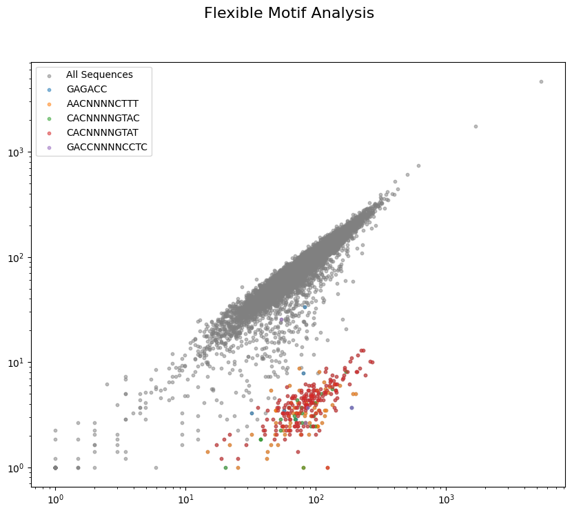

# Plotting


<!-- WARNING: THIS FILE WAS AUTOGENERATED! DO NOT EDIT! -->

------------------------------------------------------------------------

<a
href="https://github.com/dbikard/randseq/blob/main/randseq/plotting.py#L16"
target="_blank" style="float:right; font-size:smaller">source</a>

### plot_motif_analysis

>  plot_motif_analysis (counts_df, sample_col, ref_col, flexible_motifs_df,
>                           left_context_str, right_context_str,
>                           title_main='Flexible Motif Analysis', pseudocount=1)

*Generates two subplots for position-independent motifs, considering
sequence context.*

``` python
counts_file="countsTable.csv"
file_path=os.path.join(data_path,counts_file)
counts=pd.read_csv(file_path, index_col=0)
counts = counts[[col for col in counts.columns if ("_T0" in col) or ("MFDpir" in col)]]

log2fc_df = calculate_log2fc(counts, reference_column='MFDpir', count_threshold=20, pseudocount=1)
```

``` python
left, right = "GTCCTAGGTATAATACTAGT", "GTTTTAGAGCTAGAAATAGC"
core_fixed_motifs_df, flexible_motifs_df = find_restricted_motifs(log2fc_df["JJ1886_T0"], 
                        left,
                        right, 
                        fixed_motif_scan_depth_k=6,
                        fixed_motif_max_length=5,
                        fixed_motif_depletion_thr=-1,
                        fixed_motif_score_thr=0.85,
                        fixed_motif_min_support=5,
                        core_motif_score_margin=0.05,
                        flexible_motif_patterns=[(6,0,0),(4,4,4),(3,4,4),(2,4,3),(3,5,4)],
                        flexible_motif_log2fc_thr=-1,
                        flexible_motif_min_support=3,
                        flexible_motif_score_thr=0.85
                        )
```

    --- Starting Fixed-Position Motif Analysis (on original short sequences) ---
    Analyzing motifs of length 1 to 5, scanning positions 0 to 6 from each end, for JJ1886_T0.
    Minimum sequence support for a motif: > 5 (i.e., 6 or more)
    Found 2 core motifs at fixed positions:
      - Fixed Motif: GTG, Pos: 0, Len: 3, FracDep: 1.00, AvgFC: -4.76, N: 187
      - Fixed Motif: AAAG, Pos: 12, Len: 4, FracDep: 1.00, AvgFC: -5.08, N: 42

    --- Starting Position-Independent Motif Analysis on Filtered Sequences (with context) ---
    Filtered log2fc_series for flexible analysis: 11275 sequences remaining.

    Identified 21 raw flexible motifs. Now filtering to core flexible motifs...
    Found 5 core flexible motifs:
      - Flex Motif: GAGACC (from pattern (6, 0, 0)), FracDep: 1.00, AvgFC: -4.31, N: 9
      - Flex Motif: AACNNNNCTTT (from pattern (3, 4, 4)), FracDep: 1.00, AvgFC: -5.33, N: 21
      - Flex Motif: CACNNNNGTAC (from pattern (3, 4, 4)), FracDep: 1.00, AvgFC: -5.24, N: 20
      - Flex Motif: CACNNNNGTAT (from pattern (3, 4, 4)), FracDep: 1.00, AvgFC: -4.43, N: 5
      - Flex Motif: GACCNNNNCCTC (from pattern (4, 4, 4)), FracDep: 1.00, AvgFC: -4.36, N: 4

``` python
plot_motif_analysis(counts, "JJ1886_T0", "MFDpir", flexible_motifs_df, left, right)
```


